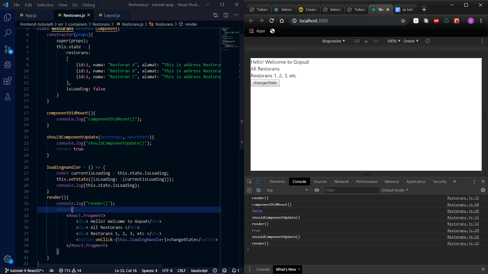

# Tutorial APAP
## Authors
* **shania.nabilah** - *<1706044175>* - *C*  

###TUTORIAL 2
1. Error karena belum ada templates add-resto
2. Link berhasil dibuka karena sudah ada template add-resto
3. http://localhost:8080/restoran/view/idRestoran/1
4. Akan 2 restoran yang sudah ditambahkan

###TUTORIAL 3
1. Pada class MenuDb, terdapat method findByRestoranIdRestoran, apakah kegunaan dari
   method tersebut?
   Untuk mendapatkan list menu berdasarkan id restorannya
2. Pada class RestoranController, jelaskan perbedaan method addRestoranFormPage dan
   addRestoranSubmit?
   Pada addRestoranFormPage menggunakan request method get, sedangkan pada addRestoranSubmit menggunakan request method post
3. Jelaskan apa kegunaan dari JPA Repository?
   Java Persistence API Repository berguna untuk persisting objek java ke database. JPA bisa dipakai untuk melakukan query, mengakses objek, dan melakukan define pada data
4. Sebutkan dan jelaskan di bagian kode mana sebuah relasi antara RestoranModel dan
   MenuModel dibuat?
   Di RestoranModel:
   @OneToMany(mappedBy = "restoran", fetch = FetchType.LAZY, cascade = CascadeType.ALL)
       private List<MenuModel> listMenu;
   Di MenuModel:
   @ManyToOne(fetch = FetchType.EAGER, optional = false)
       @JoinColumn(name = "restoranId", referencedColumnName = "idRestoran", nullable = false)
       @OnDelete(action = OnDeleteAction.CASCADE)
       @JsonIgnore
       private RestoranModel restoran;
5. Jelaskan kegunaan FetchType.LAZY, CascadeType.ALL, dan FetchType.EAGER
    1. FetchType.LAZY digunakan ketika terdapat 2 entitas yang memiliki relasi. Dengan menggunakan fetch type lazy maka entitas tersebut akan mengambil atribut entitas lain apabila dibutuhkan
    2. CascadeType.ALL digunakan ketika terdapat relasi antar 2 entitas. Dengan menggunakan cascade type all maka apabila terdapat perubahan pada satu entitas akan mengubah entitas satunya lagi
    3. FetchType.EAGER digunakan ketika terdapat suatu entitas yang ingin diakses dari database oleh entitas lain maka seluruh atribut akan langsung di load tanpa suatu kondisi tertentu
   
###TUTORIAL 4
1. Jelaskan yang anda pelajari dari melakukan latihan nomor 2, dan jelaskan tahapan bagaimana
   anda menyelesaikan latihan nomor 2!
   Pada latihan nomor 2, saya belajar untuk membuat navbar yang dinamis. Sehingga judul navbar akan berubah sesuai dengan halaman yang sedang diakses. Dalam mengerjakan latihan ini, saya menambahkan
   'brand' di fragment.html yang akan di replace sesuai dengan 'brand' yang saya tulis di setiap halaman html masing-masing
   
2. Jelaskan yang anda pelajari dari latihan nomor 3, dan jelaskan tahapan bagaimana anda
   menyelesaikan latihan nomor 3!
   Pada latihan 3, saya membuat fitur yang dapat menambahkan lebih dari satu menu secara bersamaan. pada tahap ini saya mengubah total form-add-menu agar sesuai dengan format yang diminta.
   kemudian saya mengubah controller dan menambahkan method untuk proses addRow, deleteRow, dan save
  
3. Jelaskan perbedaan th:include dan th:replace!
    th:include digunakan untuk meng-include seluruh konten dari fragment ke host-tag nya. th:replace digunakan untuk menggantikan host-tagnya. tag host ini membantu dalaman grouping fragments ke satu atau lebih halaman
    
4. Jelaskan bagaimana penggunaan th:object beserta tujuannya!
    th:object digunakan untuk membuat object di html yang kemudian akan dirender oleh object dari method addAttribute yang ada di controller. sehingga object
    yang ada di html juga merupakan object yang ada di controller
    
###TUTORIAL 5
1. Jelaskan bagian mana saja dari test yang dibuat pada latihan no 2 adalah given, when, dan and
   then.
   - given : menginisiasi RestoranModel dan ketika restoranService.getRestoranByIdRestoran(1L), 
             maka akan mengembalikan newRestoran sebagai RestoranModel yang telah diinisiasi
   - when : yang diuji adalah restoranService.getRestoranByIdRestoran(1L)
   - and then : hasil yang diharapkan seperti yang ada dalam codingan. lalu mem-verify
                apakah restoranService ketika dipanggil sekali akan melakukan interaksi .getRestranByIdRestoran(1L)
   
2. Jelaskan perbedaan line coverage dan logic coverage.
    - Line coverage adalah Line coverage mengukur berapa banyak statement yang diambil (statement biasanya berupa lien of code, tidak termasuk comments, conditionals, dll)
    - Logic coverage adalah kondisi dimana terhubung dengan logical operator untuk membuat sebuah keputusan
    
3. Pada keadaan ideal, apa yang seharusnya dibuat terlebih dahulu, code atau unit test? Mengapa
   seperti itu? Apa akibatnya jika urutannya dibalik, adakah risiko tak terlihat yang mungkin
   terjadi?
   Idealnya, unit test seharusnya dibuat terlebih dahulu untuk menentukan fungsionalitas yang seharusnya dapat dilakukan oleh program tersebut.
   Jika urutannya pengerjaannya dibalik mungkin saja terjadi kekurangan dalam program karena terdapat fungsionalitas yang terlewat.
   
4. [Bonus] Jelaskan mengapa pada latihan no 3, main class spring tidak diikutsertakan ke dalam
   perhitungan coverage? Apa saja yang dapat menyebabkan suatu class dapat di-exclude dari
   perhitungan code coverage.

####TUTORIAL 6
1. Apa itu postman? Apa kegunaan dari postman?
    - Postman merupakan sebuah aplikasi berupa plugin untuk browser chrome sebagai REST Client atau istilahnya adalah aplikasi yang digunakan untuk menguuji coba REST API yang telah dbuat.
    - Postman merupakan tool wajib untuk para developer yang berkutat pada pembuatan API
    - Fungsi utama dari postman adalah sebagai GUI API Caller, tetapi postman sekarang juga menyadiakan fitur lain, yaitu Sharing Collection API for Documentation (free), Testing API (free), Realtime Collaboration Team (paid), Monitoring API (paid), Integration (paid). 
    - Postman sangat direkomendasikan untuk develop API

2. Apa kegunaan dari annotation @JsonIgnoreProperties?
   Untuk menekan serialisasi properti (selama serialisasi), atau mengabaikan pemrosesan properti JSON yang dibaca (saat deserialisasi).

3. Apa itu ResponseEntity dan apa kegunaannya?
   ResponseEntity mewakili seluruh respons HTTP: kode status, header, dan body. Kegunaan dari ResponseEntity adalah untuk mengkonfigurasi respons HTTP sepenuhnya.

####TUTORIAL 7
1. Jelaskan secara singkat perbedaan Otentikasi dan Otorisasi! Di bagian mana (dalam kode
   yang telah anda buat) konsep tersebut diimplementasi?
   - Authentication : Memastikan bahwa username dan password sudah sesuai. implementasi pada kode terdapat pada form login
   - Authorization : Menentukan apakah user memiliki akses atau tidak. implementasi kode terdapat pada method configure yang berada di WebSecurityConfig
2. Apa itu BCryptPasswordEncoder? Jelaskan secara singkat cara kerjanya!
  -BCryptPasswordEncoder adalah salah satu tool yang digunakan untuk melakukan encode terhadap
   password yang ada di Spring. Jadi untuk kepentingan Security,
   suatu password tidak boleh disimpan dalam bentuk plain. Sehingga
   perlu di encode dengan memanfaatkan hashing. 
   Cara penggunaannya adalah dengan membuat objek BCryptPasswordEncoder, lalu objek
   tersebut dipanggil dan menggunakan method encode untuk
   melakukan encode terhadap password tersebut 
3. Jelaskan secara singkat apa itu UUID dan mengapa kita memakai UUID di UserModel.java?
    - UUID adalah kumpulan 32 karakter (String) yang dibuat secara acak (random) dengan teknik khusus yang dijamin unik untuk setiap data. Dalam waktu 1 detik pun, jika di-generate 1000 UUID, kecil kemungkinan ada UUID yang sama. Sehingga lebih cocok untuk digunakan sebagai Primary Key. Sehingga pada UserModel.java memakai UUID untuk keunikan antar user dan juga keamanan.
    UUID tersebut tentu saja sulit ditebak oleh pengguna karena tidak mempunyai pola khusus. Jika ada hacker yang ingin menggunakan program looping untuk mendapatkan seluruh data User, maka dia perlu membuat banyak kombinasi 32 karakter tersebut, tentu tidak mudah dan membutuhkan waktu lama.

4. Apa kegunaan class UserDetailsServiceImpl.java? Mengapa harus ada class tersebut
   padahal kita sudah memiliki class UserRoleServiceImpl.java?
   - UserDetailsServiceImpl.java berguna untuk membangun autentikasi user. didalam class ini dilakukan extends terhadap UserServiceDetail dari spring security.
     Class ini akan menghasilkan UserDetail object yang akan memberikan informasi terkait user yang terdapat dari db dan juga memberikan otorisasi
     yang dimiliki user sesuai dengan role yang dimiliki. Sedangkan UserServiceImpl digunakan untuk mengatur mapping yang dilakukan user

### TUTORIAL 8
1. untuk menyelesaikan soal nomor 1, saya memodifikasi checkbox pada line input checkbox yang berada pada file item.js sehingga checkbox hanya muncul pada list favorite. apabila checked=true maka checkbox akan muncul, sedangkan 
2. untuk menyelesaikan soal nomor 2, saya menghapus baris else yang berfungsi untuk menghapus menu dari targetInd yang berada pada app.js sehingga menu pada bagian kiri tidak bisa menghapus menu dari daftar favorite. menu bagian kiri hanya bisa melakukan add to favorite

3. untuk menyelasikan soal nomor 3, saya menambahkan function pada app.js yang berfungsi untuk menyembunyikan daftar favorite menggunakan function handleToggle. pada constructor defaultnya adalah menyembunyikan daftar favorite. kemudian apabila checkbox show favorite ditekan, akan memanggil function handleToggle tadi yang akan mengubah state dari blind menjadi show dan sebaliknya.

4. untuk menyelesaikan soal nomor 4, saya membuat file baru di folder components yang bernama EmptyState.js. file tersebut berisi tulisan yang akan ditampilkan apabila belum ada menu yang ditambahkan ke daftar favorite. lalu pada file App.js saya mengimport file yang baru dibikin, yaitu EmptyState. kemudian memodifikasi sedikit bagian daftar favorite sehingga apabila favItems belum ada isinya, maka akan memunculkan empty state yang sudah dibuat sebelumnya.

### TUTORIAL 9
1. Ceritakan langkah - langkah yang kalian lakukan untuk solve LATIHAN no.1, dan
mengapa kalian melakukan langkah - langkah tersebut?
    - Mengganti state pada method submitAddRestoran menjadi string kosong agar setelah menekan tombol submit pada saat tambah restoran, state yg berisi data restoran akan menjadi kosong
    - Mengganti state pada method submitEditRestoran menjadi string kosong agar setelah menekan tombol submit pada saat edit restoran, state yg berisi data restoran akan menjadi kosong
2. Jelaskan fungsi dari async dan await!
    - async ensures that the function returns a promise
    - await makes JavaScript wait until that promise settles and returns its result.
3. Masukkan jawaban dari TODO (Screenshot) pada Component Lifecycle pada
pertanyaan ini.

4. Jelaskan fungsi dari componentDidMount, shouldComponentUpdate,
componentDidUpdate, componentWillReceiveProps,
componentWillUnmount.
    - componentDidMount: saat component berhasil di render untuk pertama kalinya
    - shouldComponentUpdate: dipanggil setelah componentWillReceiveProps dipanggil dan akan mengembalikan antara true atau false. apabila true, maka component akan di update, sebaliknya apabila false maka component tidak di update
    - componentDidUpdate: dipanggil setelah render berhasil dijalankan
    - componentWillReceiveProps: saat sebuah instansi dari suatu component di update. dipanggil sebelum render dimulai
    - componentWillUnmount: dpnaggil sebelum suatu component dipindahkan dari DOM. jika suatu component membutuhkan cleanup, maka seharusnya ditaruh di dalam componentWillMount