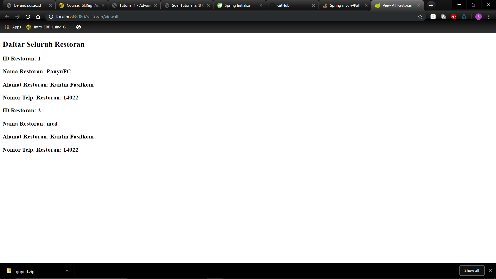

# Tutorial APAP
## Authors
* **shania.nabilah** - *<1706044175>* - *C*  

###TUTORIAL 2
1. Error karena belum ada templates add-resto
2. Link berhasil dibuka karena sudah ada template add-resto
3. http://localhost:8080/restoran/view/idRestoran/1
4. Akan 2 restoran yang sudah ditambahkan

###TUTORIAL 3
1. Pada class MenuDb, terdapat method findByRestoranIdRestoran, apakah kegunaan dari
   method tersebut?
   Untuk mendapatkan list menu berdasarkan id restorannya
2. Pada class RestoranController, jelaskan perbedaan method addRestoranFormPage dan
   addRestoranSubmit?
   Pada addRestoranFormPage menggunakan request method get, sedangkan pada addRestoranSubmit menggunakan request method post
3. Jelaskan apa kegunaan dari JPA Repository?
   Java Persistence API Repository berguna untuk persisting objek java ke database. JPA bisa dipakai untuk melakukan query, mengakses objek, dan melakukan define pada data
4. Sebutkan dan jelaskan di bagian kode mana sebuah relasi antara RestoranModel dan
   MenuModel dibuat?
   Di RestoranModel:
   @OneToMany(mappedBy = "restoran", fetch = FetchType.LAZY, cascade = CascadeType.ALL)
       private List<MenuModel> listMenu;
   Di MenuModel:
   @ManyToOne(fetch = FetchType.EAGER, optional = false)
       @JoinColumn(name = "restoranId", referencedColumnName = "idRestoran", nullable = false)
       @OnDelete(action = OnDeleteAction.CASCADE)
       @JsonIgnore
       private RestoranModel restoran;
5. Jelaskan kegunaan FetchType.LAZY, CascadeType.ALL, dan FetchType.EAGER
    1. FetchType.LAZY digunakan ketika terdapat 2 entitas yang memiliki relasi. Dengan menggunakan fetch type lazy maka entitas tersebut akan mengambil atribut entitas lain apabila dibutuhkan
    2. CascadeType.ALL digunakan ketika terdapat relasi antar 2 entitas. Dengan menggunakan cascade type all maka apabila terdapat perubahan pada satu entitas akan mengubah entitas satunya lagi
    3. FetchType.EAGER digunakan ketika terdapat suatu entitas yang ingin diakses dari database oleh entitas lain maka seluruh atribut akan langsung di load tanpa suatu kondisi tertentu
   
###TUTORIAL 4
1. Jelaskan yang anda pelajari dari melakukan latihan nomor 2, dan jelaskan tahapan bagaimana
   anda menyelesaikan latihan nomor 2!
   Pada latihan nomor 2, saya belajar untuk membuat navbar yang dinamis. Sehingga judul navbar akan berubah sesuai dengan halaman yang sedang diakses. Dalam mengerjakan latihan ini, saya menambahkan
   'brand' di fragment.html yang akan di replace sesuai dengan 'brand' yang saya tulis di setiap halaman html masing-masing
   
2. Jelaskan yang anda pelajari dari latihan nomor 3, dan jelaskan tahapan bagaimana anda
   menyelesaikan latihan nomor 3!
   Pada latihan 3, saya membuat fitur yang dapat menambahkan lebih dari satu menu secara bersamaan. pada tahap ini saya mengubah total form-add-menu agar sesuai dengan format yang diminta.
   kemudian saya mengubah controller dan menambahkan method untuk proses addRow, deleteRow, dan save
  
3. Jelaskan perbedaan th:include dan th:replace!
    th:include digunakan untuk meng-include seluruh konten dari fragment ke host-tag nya. th:replace digunakan untuk menggantikan host-tagnya. tag host ini membantu dalaman grouping fragments ke satu atau lebih halaman
    
4. Jelaskan bagaimana penggunaan th:object beserta tujuannya!
    th:object digunakan untuk membuat object di html yang kemudian akan dirender oleh object dari method addAttribute yang ada di controller. sehingga object
    yang ada di html juga merupakan object yang ada di controller
    
###TUTORIAL 5
1. Jelaskan bagian mana saja dari test yang dibuat pada latihan no 2 adalah given, when, dan and
   then.
   - given : menginisiasi RestoranModel dan ketika restoranService.getRestoranByIdRestoran(1L), 
             maka akan mengembalikan newRestoran sebagai RestoranModel yang telah diinisiasi
   - when : yang diuji adalah restoranService.getRestoranByIdRestoran(1L)
   - and then : hasil yang diharapkan seperti yang ada dalam codingan. lalu mem-verify
                apakah restoranService ketika dipanggil sekali akan melakukan interaksi .getRestranByIdRestoran(1L)
   
2. Jelaskan perbedaan line coverage dan logic coverage.
    - Line coverage adalah Line coverage mengukur berapa banyak statement yang diambil (statement biasanya berupa lien of code, tidak termasuk comments, conditionals, dll)
    - Logic coverage adalah kondisi dimana terhubung dengan logical operator untuk membuat sebuah keputusan
    
3. Pada keadaan ideal, apa yang seharusnya dibuat terlebih dahulu, code atau unit test? Mengapa
   seperti itu? Apa akibatnya jika urutannya dibalik, adakah risiko tak terlihat yang mungkin
   terjadi?
   Idealnya, unit test seharusnya dibuat terlebih dahulu untuk menentukan fungsionalitas yang seharusnya dapat dilakukan oleh program tersebut.
   Jika urutannya pengerjaannya dibalik mungkin saja terjadi kekurangan dalam program karena terdapat fungsionalitas yang terlewat.
   
4. [Bonus] Jelaskan mengapa pada latihan no 3, main class spring tidak diikutsertakan ke dalam
   perhitungan coverage? Apa saja yang dapat menyebabkan suatu class dapat di-exclude dari
   perhitungan code coverage.
    

